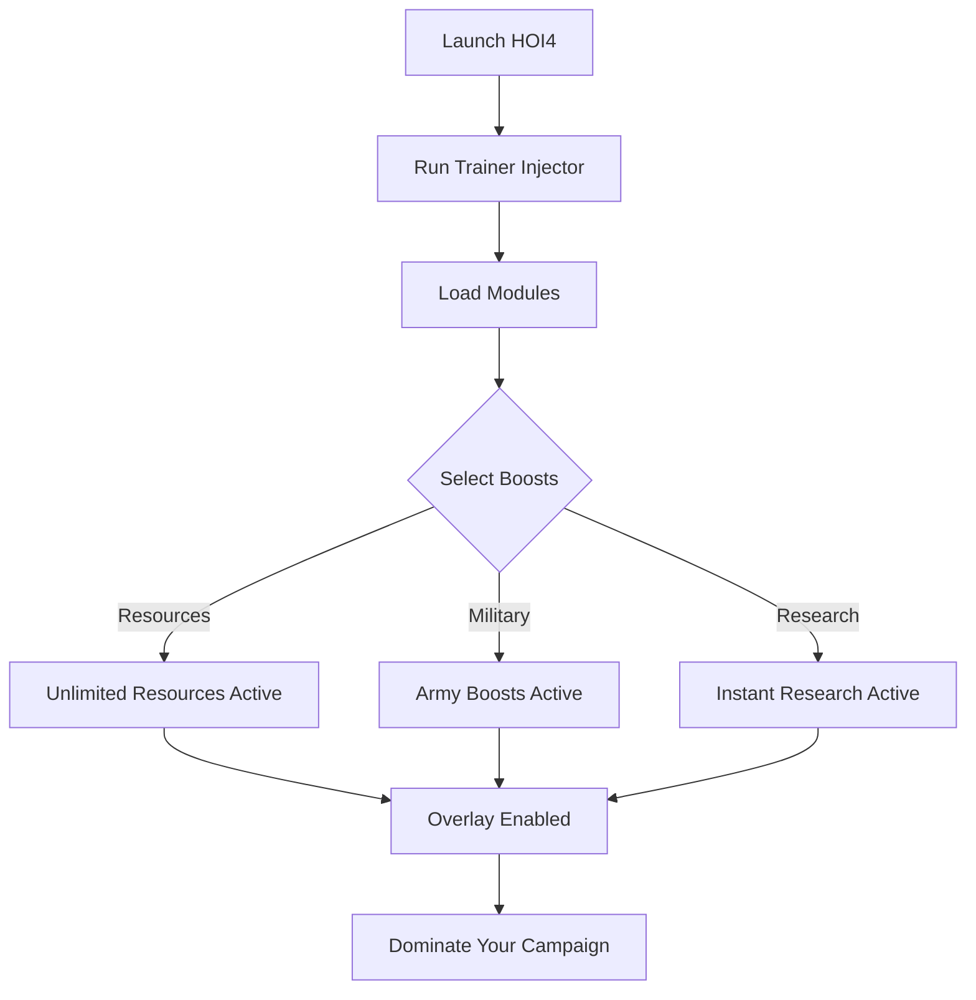

# Hearts of Iron IV Trainer ⚙️

**Hearts of Iron IV (HOI4)** is one of the deepest grand strategy games ever made, where every decision—from research to troop deployment—can shift the course of history. For players who want more flexibility, the **HOI4 Trainer** provides **resource management, instant research, and military boosts** to give you an edge in complex campaigns.

---

## 🌐 Overview

This trainer is designed for **single-player customization**. Whether you want unlimited manpower, instant construction, or rapid research, the trainer allows you to adjust mechanics mid-game with hotkeys. It’s optimized for Windows PCs, lightweight, and easy to configure.

---

## 🔑 Features

* 💰 **Unlimited Resources** – Fuel, political power, manpower, and factories.
* ⚡ **Instant Research** – Complete technologies instantly.
* 🏭 **Fast Construction** – Speed up buildings, tanks, and planes.
* 🪖 **Army Boosts** – Max org, morale, and instant training.
* ✈️ **Air & Naval Enhancements** – Stronger fleets and air dominance.
* 🗂 **Profile Loader** – Save configs for different campaigns.
* ⌨️ **Hotkey Switching** – Toggle boosts instantly in-game.
* 🔒 **Stealth Injection** – Lightweight trainer for Windows 10/11.

---

[](#)
[](#)
[](#)
[](#)

---

## 🖥 Compatibility

| Platform       | Status        | Notes                        |
| -------------- | ------------- | ---------------------------- |
| Windows 10     | ✅ Supported   | Stable builds                |
| Windows 11     | ✅ Optimized   | Smoothest trainer experience |
| Linux (Proton) | ⚠️ Partial    | Limited support              |
| macOS          | ❌ Unsupported | Requires VM workaround       |

\[!NOTE]
Trainer is best optimized for **Windows with DirectX builds** of HOI4.

---

## ⚙️ Setup Guide

1. Download the Hearts of Iron IV Trainer.

2. Extract into a secure folder.

3. Launch HOI4.

4. Run trainer as administrator:

   ```bash
   hoi4_trainer.exe -game hoi4.exe -mode overlay
   ```

5. Configure your `config.ini`:

   ```ini
   [Resources]
   Manpower=Unlimited
   PoliticalPower=9999
   Fuel=9999
   Factories=Unlimited

   [Military]
   InstantTraining=True
   MaxOrg=True
   MoraleBoost=True

   [Research]
   Instant=True
   ```

6. Press `F1` in-game to toggle the trainer menu.

\[!IMPORTANT]
Use only in **single-player** campaigns to avoid sync issues.

---

## 📊 Trainer Workflow



---

## 🎚 Example Configurations

**Economic Power Build:**

```ini
Manpower=Unlimited
Factories=Unlimited
PoliticalPower=5000
```

**Military Blitz Build:**

```ini
InstantTraining=True
MaxOrg=True
Fuel=9999
```

**Tech Superiority Build:**

```ini
InstantResearch=True
Factories=Unlimited
PoliticalPower=9999
```

\[!WARNING]
Extreme boosts can make campaigns trivial—use moderation for balanced play.

---

## ❓ FAQ

**Q: Does this trainer work in multiplayer?**
A: No, it’s for single-player only.

**Q: Will it desync achievements?**
A: Yes, using cheats disables Ironman achievements.

**Q: Does it affect FPS or stability?**
A: No, it’s lightweight with minimal performance impact.

**Q: Do updates sync with HOI4 patches?**
A: Yes, new versions release after major patches.

**Q: Can I save profiles for different campaigns?**
A: Yes, configs can be saved and hotkey-switched.

---

## 🚀 Final Thoughts

The **Hearts of Iron IV Trainer** empowers players with **instant research, unlimited resources, and military boosts**. Whether rewriting WWII history or experimenting with alt-history scenarios, it gives you the freedom to play your way.

[](#)
[](#)
[](#)

---
